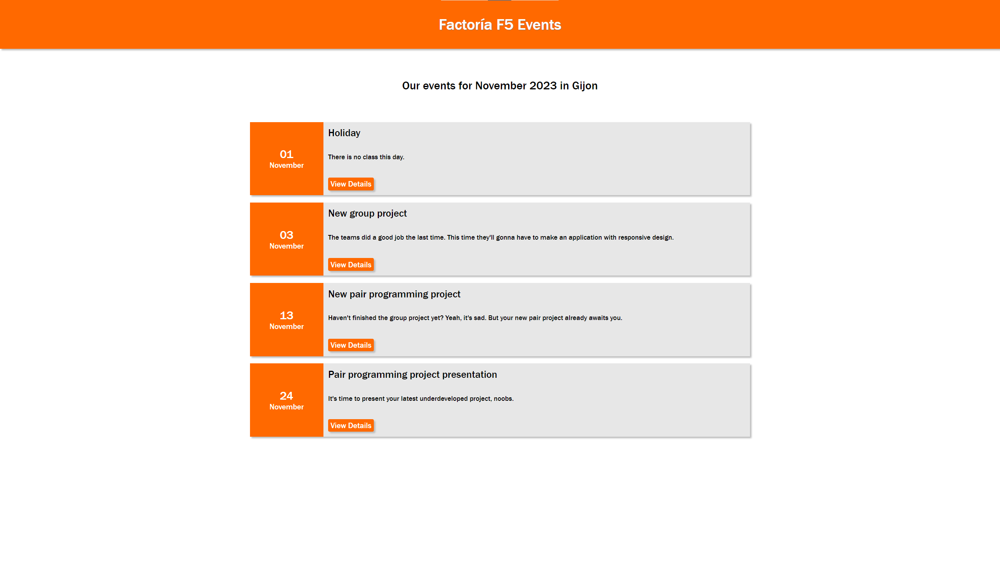

# List of events with a dropdown menu. Factoria F5 challenge.

The task was to create a list of events with containing an animated dropdown list with additional details. The project was created based on a real bootcamp schedule with elements of humor.

## GitHub Pages link

https://markwebdeveloper.github.io/Dropdown-Events/

## Installs

In order to work with this project you need to run "npm install" command first. It will install the following dependencies:

Sass  
Scss-Reset  
Typescript  
Vite

## Screenshots

# Thank you!